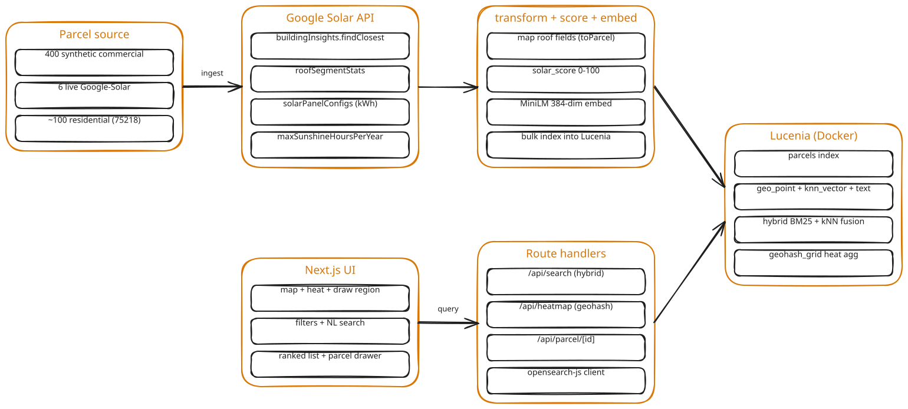
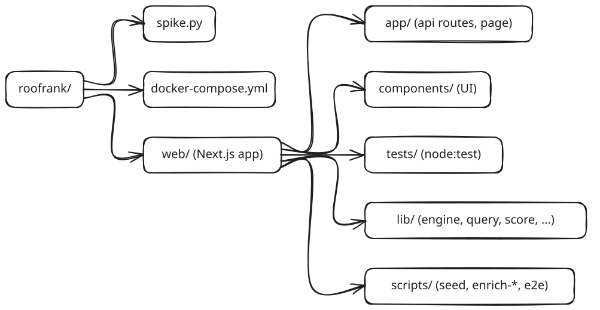

<p align="center">
  
</p>

<h1 align="center">RoofRank</h1>

<p align="center"><em>Commercial and residential solar prospecting as a search problem, built on Lucenia.</em></p>

---

**Commercial-solar prospecting as a search problem.** A solar sales team draws a region on a map, types a plain-language intent ("aging flat warehouse roofs that read as re-roof-plus-solar candidates"), and gets back a ranked, heat-colored map of the best rooftops to pitch before the commercial clean-energy tax credit deadline.

Built on **Lucenia** (the retrieval engine) with **Google's Solar API** as an ingest-time enrichment helper.

## Contents

- **I.** [Why RoofRank, and why Lucenia](#why-this-and-why-lucenia)
- **II.** [Architecture](#architecture)
- **III.** [Verified on Lucenia skylite 0.11.0](#verified-on-lucenia-skylite-0110)
- **IV.** [Lucenia vs Google: the API surface](#api-surface-which-calls-are-lucenia-vs-google)
- **V.** [More Lucenia features in use](#more-lucenia-features-in-use-beyond-the-core-hybrid-query)
- **VI.** [How ranking works](#how-ranking-works)
- **VII.** [Run it](#run-it)
- **VIII.** [Project structure](#project-structure)
- **IX.** [Prospecting UX](#prospecting-ux)
- **X.** [Key decisions](#key-decisions)

---

## Why this, and why Lucenia

Solar customer acquisition is expensive (installers pay $100-300+ per qualified lead). The "find good roofs, then sell" workflow is really a **search-and-rank** problem over a large parcel corpus. Existing tools split into two camps:

- **Single-address design/proposal tools** (Aurora, OpenSolar, Solargraf): one address in, one proposal out. Not prospecting.
- **A few structured scan-and-rank tools** (Planno, an indie "SolarProspector", Station A): they filter and rank many roofs, but with **structured filters only**.

**Nobody combines geo + numeric + boolean + *semantic* (natural-language) in one ranked query.** That intersection is exactly what Lucenia does and a Postgres/PostGIS or a plain vector DB cannot:

| Concern | Owner |
|---|---|
| `geo_shape`/`geo_point` storage, `geo_bounding_box` filtering | **Lucenia** |
| Hybrid scoring: BM25 (lexical) + kNN (vector) + numeric/boolean filters in one query | **Lucenia** |
| `geohash_grid` heat aggregation tied to the live query | **Lucenia** |
| Ranking prospects by a composite `solar_score` | **Lucenia** |
| Roof geometry, azimuth/pitch/area, sunshine, panel layout, kWh | Google Solar API (ingest helper) |

> **BM25** is the standard keyword-relevance ranking that powers Lucene/OpenSearch text search (it scores how well a document's words match the query). **kNN** ("k nearest neighbors") ranks by vector similarity between the query's embedding and each document's embedding, so it matches on meaning rather than exact words. Hybrid search blends the two.

The clearest demo: toggle **Structured** vs **Hybrid** on the same filters. Structured ranks the shiny new-roof warehouse first (highest score); Hybrid surfaces the *aging* roof that reads as a re-roof-plus-solar candidate, an intent a filter UI can't express. That is the "Lucenia is the ideal technical choice" proof.

**Why now**

("§" is the section symbol for a numbered part of the U.S. tax code, so **§48E** means Internal Revenue Code Section 48E.)

- Under OBBBA (2025), the owner-purchased residential solar credit (**§25D**) expired **2025-12-31**.
- The begin-construction safe harbor for the commercial clean-electricity credit (**§48E**/**45Y**) closed **2026-07-04**; the live federal deadline is now placed in service by **2027-12-31**.
- That pushes residential demand toward third-party-owned (lease/PPA) systems, which still capture ~30% via **§48E** because the owner is a business.
- So the commercial and residential-via-TPO segments RoofRank ranks now share one urgent federal deadline, which is exactly when a prospecting tool earns its keep.

---

## Architecture



Two paths meet at Lucenia. The **ingest** path runs once, offline; the **query** path runs on every search.

- **Parcel source**, the corpus that gets indexed: 400 synthetic DFW commercial parcels (seeded, reproducible), 6 real commercial parcels enriched live via Google Solar, and ~100 real residential parcels in ZIP 75218.
- **Google Solar API**, `buildingInsights.findClosest` supplies roof geometry per building. Ingest-time only; never called during a search.
- **transform + score + embed**, each parcel gets a `solar_score` (0-100) and a 384-dim MiniLM description vector, computed locally.
- **Lucenia (Docker)**, the `parcels` index: `geo_point` + `knn_vector` + numeric/keyword/text fields, serving hybrid BM25 + kNN queries and the geohash heat aggregation.
- **Next.js UI → Route handlers**, the browser talks only to Next.js route handlers, which query Lucenia through the opensearch-js client.

_Diagram source: [`docs/diagrams/build_architecture.py`](docs/diagrams/build_architecture.py) (emits `architecture.excalidraw`, rendered to SVG with excalidraw-cli)._

- **Engine:** Lucenia `skylite 0.11.0` (OpenSearch 2.14 wire-compatible). Hybrid ranking fuses BM25 + filtered kNN **client-side** (min-max normalize each score list, then weighted combine). Lucenia's native `hybrid` query works on this node, but it returns a single combined score per doc and there is no functional score-normalization step to weight the sub-queries (see the verified note below), so **client-side fusion is the only way to get real, tunable `[BM25, kNN]` weights** on this build, not just a workaround. Verified: flipping the client weights reorders results on the live node.
- **Embeddings:** local MiniLM (`@huggingface/transformers`, `all-MiniLM-L6-v2`, 384-dim). Private, no external embedding calls.
- **App:** one Next.js 16 app. Route handlers are the API (client never talks to Lucenia directly). Tailwind v4 design tokens (solar/amber), `@vis.gl/react-google-maps` for the map.

### Verified on Lucenia skylite 0.11.0

Lucenia tracks the OpenSearch 2.14 API, but its docs describe a superset of what this build ships. Each of these was checked against the running node:

- **`hybrid` query clause, present and works.** `{"query":{"hybrid":{"queries":[{match…},{knn…}]}}}` returns results. But without a working normalization step it emits a single un-normalized combined score and ignores per-query weights (below), so it can't drive tunable fusion on its own.
- **`normalization-processor`, accepted but inert on this build.** `PUT /_search/pipeline` with a `normalization-processor` returns `acknowledged:true`, yet: (a) flipping its weights `[0.95,0.05]`↔`[0.05,0.95]` does not reorder results, (b) with-pipeline scores are byte-identical to no-pipeline and are raw (≈4.6, not a normalized 0–1), and (c) `_nodes/search_pipelines` registers **no `phase_results_processors`** at all. So real BM25/kNN weighting is done **client-side** (`lib/query.mjs` `mergeHybrid`: min-max normalize each list, then weighted combine), the only path to tunable weights here.
- **`geohex_grid`, not supported** (`parsing_exception`). The heatmap uses **`geohash_grid`** (verified working) with `avg(solar_score)` + `geo_centroid` sub-aggregations.

These are version facts about `skylite 0.11.0`, not permanent Lucenia limits, a build that ships a functional `normalization-processor` could move fusion server-side unchanged, since the app already speaks the `hybrid` query shape.

### Data and Google's caching policy

The searchable corpus is **~400 synthetic DFW commercial parcels** (reproducible, seeded) plus **6 real commercial parcels enriched live via the Google Solar API** (labeled `LIVE · Google Solar`) and **~100 real residential parcels in ZIP 75218** (exact-address-geocoded houses + real Redfin for-sale listings with list price, beds/baths, and living area). This split is deliberate: Google's Solar API policy **restricts caching/storing** its results, so a production build cannot pre-index Google's per-building data at scale. The production-clean path (described, not built here) is to **compute solar potential from open rasters** (USGS LiDAR DSM + NREL NSRDB + PVWatts) and index *your* derived values in Lucenia, with Google Solar used only live at view-time. "Compute and index, don't cache a vendor's API."

**Residential data quality:** houses are located by exact-address geocoding, not arbitrary grid points, because `buildingInsights.findClosest` will otherwise mis-snap to a large neighbor (a warehouse or apartment block on a major road) and report commercial-scale roof numbers on a home. As a backstop, any residential parcel resolving to a >6,000 sqft roof is dropped as a mis-snap at ingest.

---

## API surface: which calls are Lucenia vs Google

The division is deliberate: **Google answers "what is this roof, physically?" once, at ingest. Lucenia answers "which roofs match this intent, ranked, in this area?" on every search.**

**Lucenia, the retrieval / ranking / geo engine (every query at search time):**

- **Index mapping** (`lib/schema.mjs`): `geo_point` (centroid), `knn_vector` (384-dim, HNSW, `engine: lucene`, `space_type: cosinesimil`), analyzed `text` (`description` → BM25), `keyword`/`float`/`integer`/`boolean` facets, and a `nested` `roof_segments`. `index.knn: true`.
- **Lexical:** `match` on `description` (BM25).
- **Vector:** `knn` query on `description_vector` with `k` + an inline `filter` (Lucene-engine filtered kNN).
- **Structured:** `bool` (`filter` + `must_not`), `term`/`range` facets, `sort` by `solar_score`.
- **Geo:** `geo_bounding_box` on centroid (map viewport → query).
- **Aggregation:** `geohash_grid` on centroid with `avg(solar_score)` + `geo_centroid` sub-aggregations (the heat layer).
- **Fusion:** client-side min-max normalize + weighted combine of the `match` and `knn` result lists (`lib/query.mjs` `mergeHybrid`).
- **Client:** `@opensearch-project/opensearch` (wire-compatible), raw `_search` via `transport.request`.

**Google, ingest-time enrichment only (never at search time):**

- **Solar API `buildingInsights:findClosest`** → roof physics per building: `wholeRoofStats.areaMeters2`, `roofSegmentStats` (azimuth / pitch / area / `sunshineQuantiles`), `maxArrayPanelsCount`, `maxSunshineHoursPerYear`, `solarPanelConfigs[].yearlyEnergyDcKwh`, `imageryQuality`, `center`. Mapped → scored → embedded → indexed into Lucenia (`lib/solar.mjs`).
- **Maps Geocoding API** (not Solar): `geocode` (address → lat/lng) and `reverseGeocode` (lat/lng → address) to place real houses precisely.
- **Maps JavaScript API:** the browser map + dark-mode `colorScheme` (`@vis.gl/react-google-maps`).
- **Not used:** Solar `dataLayers` (flux/DSM rasters) and Google's financial analyses. `solar_score` is computed locally from energy/roof metrics, not Google's residential financial model.

## More Lucenia features in use (beyond the core hybrid query)

Each of these is **built and live**, and was verified against the running node:

- **`geo_bounds` aggregation → the "Fit to results" button.** Computed corpus-wide via a `global` + `filter` agg that ignores the viewport, so it flies the map to matching prospects *outside* the current view rather than just tightening to what's visible (zoom-clamped for single-result bounds).
- **`percentiles` on `solar_score` → the "Top 10% of roofs in view score ≥ N" stat** in the results header (p90 over the same in-view set the list shows).
- **`top_hits` inside each `geohash_grid` cell → clickable heat cells.** Each cell carries its best-scoring parcel (a `top_hits` sub-agg sorted by `solar_score`); clicking the cell opens that parcel.
- **`geo_polygon` query → "Draw region".** Click vertices on the map to filter by an arbitrary polygon instead of the rectangular viewport (verified: a polygon over 75218 returns 108 parcels, all inside, vs ~468 for the bounding box). Note: Google removed `DrawingManager` in Maps JS 3.65, so the polygon is collected via map-click vertices on a plain `google.maps.Polygon`.
- **`knn.algo_param.ef_search = 256`** (raised from the default 100) for kNN recall headroom.

**Registered on the node but intentionally not wired (needs an ML model/connector):** `retrieval_augmented_generation` / `retrieval_grounding` (native in-engine RAG), `multimodal_rerank`, `ml_inference`. A `retrieval_augmented_generation` pipeline errors on setup, requiring a `context_field_list` and a registered model. These are the on-thesis path to in-engine "why this roof" summaries or learned reranking, and are precisely why a *separate* RAG stack (e.g. LightRAG, which was evaluated and rejected) is unnecessary here: Lucenia already owns that surface.

---

## How ranking works

**`solar_score` (0–100)** is computed at ingest (`lib/score.mjs`) from four normalized, region-capped factors:

| Factor | Weight | Normalization (DFW-tuned caps) |
|---|---|---|
| Annual energy `annual_kwh_dc` | **0.40** | ÷ 1,200,000 kWh, clamped 0–1 |
| Sunshine `sunshine_kwh_per_kw_yr` | **0.25** | (value − 1400) ÷ 500, clamped 0–1 |
| Usable roof area (sqft) | **0.20** | ÷ 90,000 sqft, clamped 0–1 |
| Roof-age favorability | **0.15** | age ÷ 25 yrs, clamped 0–1; **unknown age = 0.5** (neutral) |

`score = round(100 · (0.40·energy + 0.25·sun + 0.20·area + 0.15·ageFav))`

Energy is weighted highest because it drives ROI. Roof age is deliberately a *favorability* term, not a penalty: an older roof is a re-roof-plus-solar opportunity, so it scores **higher**, while unknown age stays neutral so live Google-Solar parcels (which have no age) aren't punished. The caps are region-relative to DFW commercial and would be recalibrated per market. The exact weights are pinned by a unit test (`tests/score.test.mjs`).

**Sorting** has three tiers, and the list and map markers always reflect the same set:

1. **Best match** (default), the engine's own relevance order: fused hybrid BM25 + kNN for the natural-language query in Hybrid mode, or `solar_score` descending in Structured mode. No client reordering.
2. **Solar / ZIP / Address**, click a field to sort client-side; click the same field again to flip asc↔desc (an arrow shows the direction).
3. **Clear**, returns to Best match.

---

## Run it

**Prereqable:** Docker, Node 20+, and either a Lucenia trial license **or** an OpenSearch 2.14 node (see below).

```bash
# 1) Start the engine
#    Lucenia needs a trial license cert (get one at https://cloud.lucenia.io/trial),
#    saved as ./trial.crt at the repo root, then:
docker compose up -d          # Lucenia on https://localhost:9200

# 2) App + data
cd web
npm install
cp .env.example .env          # fill in GOOGLE_MAPS_API_KEY (+ NEXT_PUBLIC_ copy)
npm run seed                  # create index, generate 400 commercial parcels, MiniLM-embed, bulk index
npm run enrich                # (optional) add 6 real Google-Solar commercial parcels
npm run res                   # (optional) ~7 exact-address residential houses (75218 + adjacent)
npm run redfin                # (optional) ~40 real Redfin 75218 for-sale listings (price/beds/baths)
npm run zip                   # (optional) grid-fill more 75218 houses (mis-snaps auto-dropped)
npm run dev                   # http://localhost:3000
```

**License-free alternative (Lucenia is OpenSearch-wire-compatible):** if you'd rather not obtain a Lucenia license, run any OpenSearch 2.14 node instead and point the app at it, everything works unchanged (validated):

```bash
docker run -d -p 9200:9200 -e discovery.type=single-node \
  -e OPENSEARCH_INITIAL_ADMIN_PASSWORD=RoofRank!2026Dev opensearchproject/opensearch:2.14.0
# then the same npm run seed / dev
```

On base OpenSearch the core demo behaves the same: hybrid BM25 + kNN, geo filtering, and the geohash heatmap all rely on standard APIs. What you give up is Lucenia's own ground: it is built on a newer Apache Lucene for faster vector and hybrid retrieval, and it ships native AI-retrieval processors (`retrieval_augmented_generation`, `retrieval_grounding`, `multimodal_rerank`, `ml_inference`) that base OpenSearch 2.14 does not. Those are exactly what the roadmap's in-engine "why this roof" summaries and learned reranking would build on, so Lucenia is the engine you would keep for the next stage, not just this MVP.

**Notes:** the browser map needs the **Maps JavaScript API** enabled on the key (the Solar API alone is server-side); if it isn't, the app degrades gracefully (the ranked list + search still work). The local Lucenia node uses a self-signed cert, so the server-side client sets `rejectUnauthorized:false` for `localhost` only; production terminates TLS with a real CA.

---

## Project structure



- **`docker-compose.yml`**, the Lucenia node (port 9200, mounts `trial.crt` + license env).
- **`spike.py`**, the M1 query-DSL spike (engine-agnostic, validates the search shape).
- **`web/`**, the Next.js app, which holds everything else:
  - **`lib/`**, the `.mjs` core shared by scripts and the API: `engine`, `schema`, `embed`, `score`, `generate`, `solar`, `query`, `geohash`.
  - **`scripts/`**, ingest + verification: `seed`, `enrich-live`, `enrich-residential`, `enrich-redfin`, `enrich-zip`, `scrape-year-built`, `e2e`.
  - **`app/`**, `page.tsx`, `layout.tsx`, `globals.css`, and the API route handlers `api/{search, parcel/[id], heatmap}`.
  - **`components/`**, the UI: `RoofRank`, `FilterPanel`, `ResultsList`, `ParcelDrawer`, `MapView`.
  - **`tests/`**, `node:test` unit suites: `score`, `query`, `geohash`, `solar`, `generate`.

_Diagram source: [`docs/diagrams/structure.dot`](docs/diagrams/structure.dot)._

## Prospecting UX

- **Building-type toggle** (Both / Residential / Commercial) on the ranked-prospects panel: one click re-runs the search against that segment.
- **Sort** by Solar score / ZIP / Address: click a field to sort, click again to flip direction, clear to return to **Best match** (the hybrid relevance order the engine returns).
- **Parcel drawer** shows a draft quote (residential uses ~$3.50/W + the §25D credit; commercial ~$2.80/W + §48E), a **roof-sunlight diagram** (each Google-Solar roof segment shaded in a purple gradient by annual sun), and, for real listings, price/beds/baths, price-per-sqft, a resolving listing link, and roof age from year built.
- **Collapsible filter panel** to hand the map more room.
- **Dark mode** via a pure design-token swap (`.dark` on `<html>` overrides the CSS vars): panels, drawer, inputs, cards, and the Google map (`colorScheme`) all flip together. Toggle sits left of the collapse button (and on the collapsed rail); the choice persists in `localStorage` and paints before hydration (no flash).

## Key decisions

- **Lucenia is the core engine.** RoofRank runs on Lucenia for search, ranking, geo, and aggregation; that retrieval experience is the product. Google's Solar API is a narrow tool layered on top, used only at ingest to read the solar-specific physics of each roof.
- **Semantic query is the differentiator** (the one axis no competitor has).
- **Hybrid data** sidesteps Google's caching restriction and keeps the demo fully populated.
- **`solar_score`** uses energy/roof metrics (kWh, area, sunshine, roof-age favorability), not Google's residential-tuned financial model.
- **Built lean:** one app, one search client, a local embedding model instead of a hosted pipeline, Tailwind design tokens instead of a component-library dependency, and an HTML quote instead of a PDF library.

## Not in this MVP

Scoped out for now. These are the features I want to build next:

- **AI outreach / SDR agent**
  - *What:* auto-draft and send the first-touch email or call script to a ranked prospect, personalized with that roof's numbers (size, sun, draft quote).
  - *How:* a queue over the ranked results feeding an LLM template, wired to an email/dialer API, with reply tracking; Lucenia's `retrieval_grounding` processor could ground each message in the parcel's own fields.
  - *Advantage:* closes the loop from "found the roof" to "booked the meeting," the step installers actually pay for.
- **Generative "panels on your building" render**
  - *What:* a photorealistic image of the specific building with panels laid onto its real roof planes, attached to the outreach.
  - *How:* pull the roof-segment geometry already stored per parcel, composite panels onto Google/aerial imagery via an image model.
  - *Advantage:* renders reportedly lift outreach open/response rates several-fold over a text quote.
- **Accounts, saved searches, and lead tracking**
  - *What:* per-user login, saved regions/queries, and a pipeline board of contacted prospects.
  - *How:* a Supabase (Postgres + auth) layer alongside Lucenia; Lucenia stays the search engine, Supabase holds user/CRM state.
  - *Advantage:* turns a one-off search tool into a repeat-use workflow a sales team lives in.
- **On-demand, any-region scan**
  - *What:* let a user drop into a brand-new metro and have parcels enriched and indexed on the fly, rather than the pre-seeded DFW corpus.
  - *How:* the production ingest path in [Architecture](#architecture) (compute solar potential from open LiDAR/NSRDB rasters, then index into Lucenia) run as a background job per requested region.
  - *Advantage:* national coverage without pre-indexing the whole country, and it sidesteps the Google caching limit by computing our own values.
